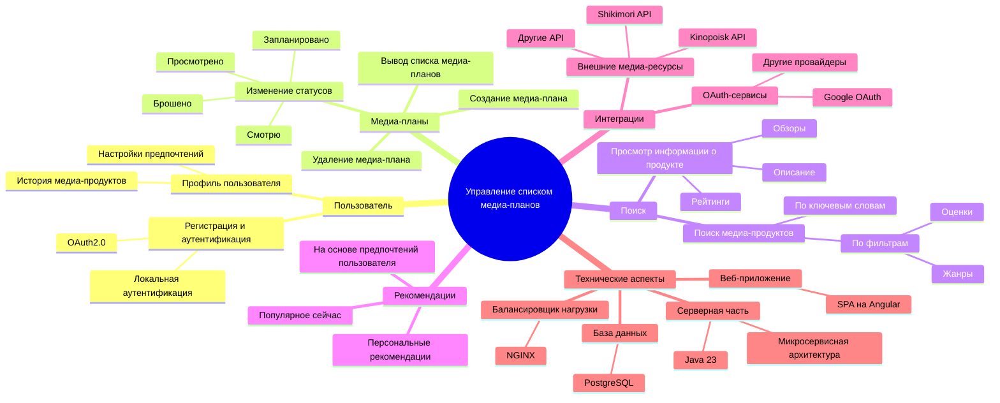
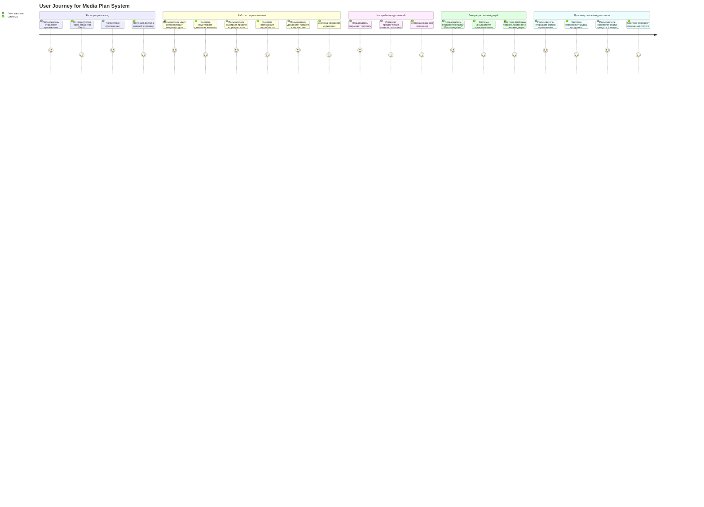
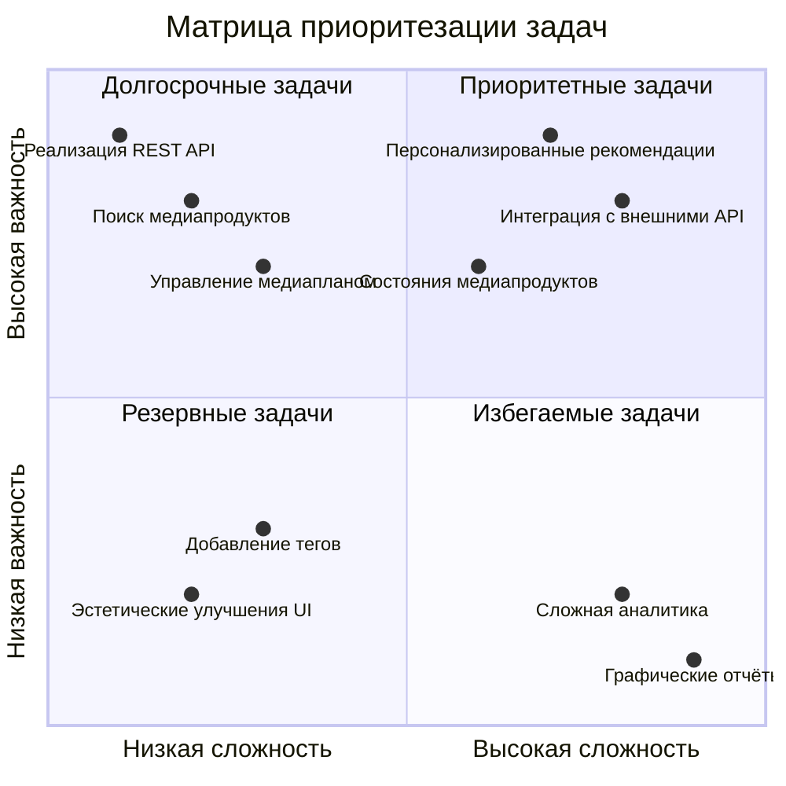
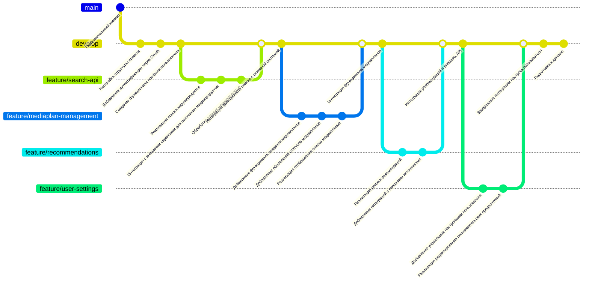

# Веб-приложение для управления списком медиа-планов

## Описание проекта
Данный проект представляет собой веб-приложение для управления списком медиа-планов. Система включает регистрацию пользователей, управление медиа-планами, поиск медиа-продуктов и личные рекомендации пользователя.  
Технологический стек: Spring Boot для серверной части и Angular для фронтенда.

---

## Диаграммы

### 1. Диаграмма структуры функциональных возможностей (Mind Map)

Эта диаграмма отображает основные функции системы для управления медиа-планами. Она включает регистрацию пользователей, управление медиа-планами, поиск медиа-продуктов, интеграцию с внешними API и генерацию рекомендаций. Также перечислены ключевые технологии, используемые для реализации системы

### 2. Диаграмма путешествия пользователя (User Journey)

Диаграмма иллюстрирует путь пользователя в системе управления медиа-планами. Пользователь начинает с регистрации в системе, создаёт медиа-план, выбирает подходящие медиа-продукты, получает рекомендации, интегрируется с внешними сервисами, такими как Media API, и в итоге анализирует результаты и статистику выполненного медиа-плана

### 3. Квадрантная диаграмма (Quadrant Chart)

Эта диаграмма визуализирует распределение функциональных возможностей системы по их ценности и сложности. Например, регистрация пользователей и просмотр отчётов являются лёгкими в использовании и высокоценными функциями, тогда как прогнозирование и аналитика медиа-планов, а также интеграция с внешними API более сложны в реализации, но имеют высокую ценность для бизнеса.

### 4. Диаграмма истории разработки (Git Graph)

Диаграмма демонстрирует этапы разработки приложения для управления медиа-планами. Каждый этап включает разработку ключевых микросервисов, таких как user-service (регистрация и управление пользователями), media-plan-service (создание и управление медиа-планами), search-service (поиск медиа-продуктов) и recommendation-service (генерация персонализированных рекомендаций). Это отображает процесс последовательной реализации и интеграции сервисов.

